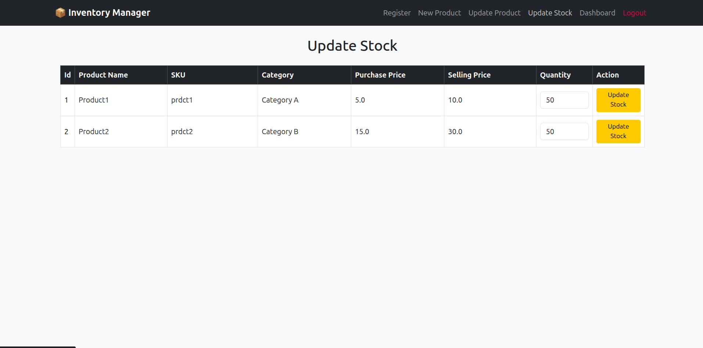

# Inventory Manager Application

### Highlights

-   Login, Register, Delete Users
-   Admin, Manager, Staff Roles
-   Add, Delete, Update Product
-   Update Stock
-   Dashboard
-   Transaction History

### Technologies/Libraries Used

-   Python
-   Flask, Flask-login
-   SQLite
-   Bootstrap

### Todo

-   Add Charts in dashboard
-   SQLite -> MySQL
-   Recent History

### Demo

_Login Page_

_Register Page_

_Add Product Page_

_Update Product Page_

_Update Stock Page_

_Dashboard Page_

_Get Users Page_
